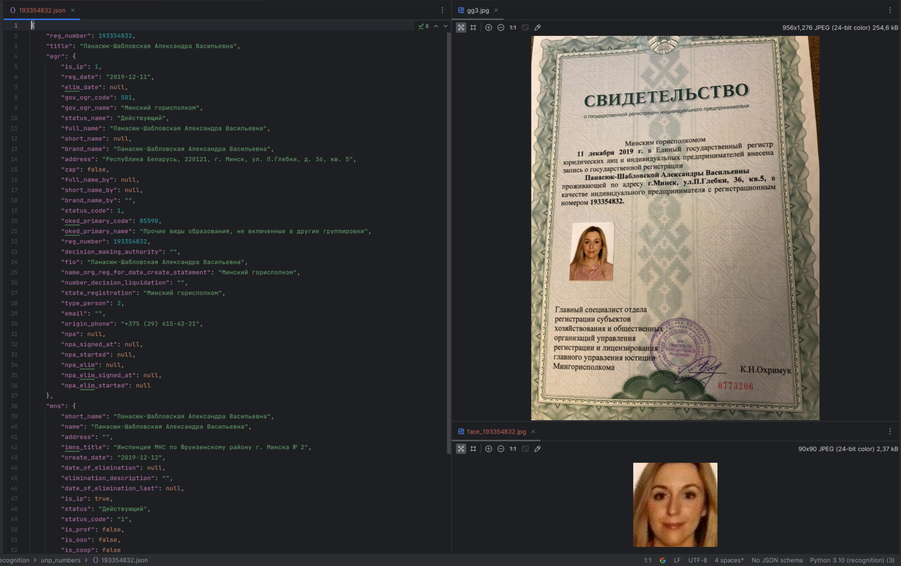

Программа создана для распознавания свидетельств о гос. регистрации индивидуальных предпринимателей в РБ.
После распознавания и получении номера, происходит запрос на api - kartoteka.by, где мы получаем все данные, которые есть в архиве.
Получение фотографии из свидетельства о гос. регистрации индивидуальных предпринимателей в РБ и сохранение его.

Для работы приложения, нужно установить все зависимости из файла requirements.txt. 
Запустите в терминале команду: pip freeze -> requirements.txt
Проект работает на Python 3.10

